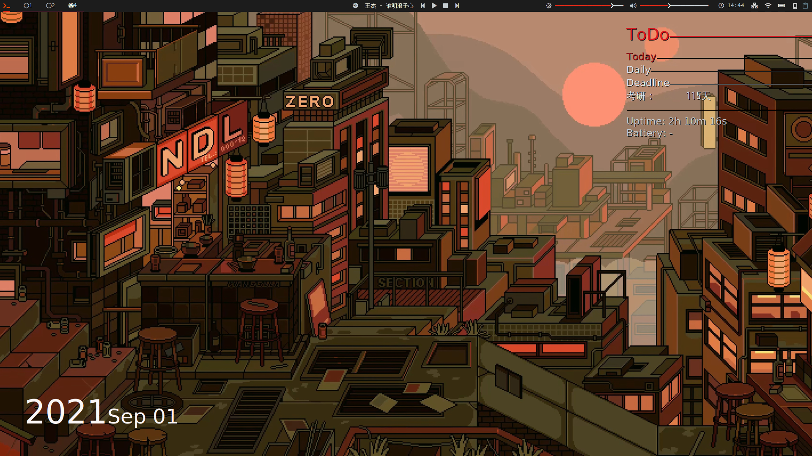

# Arch-i3_configfile

A theme config of i3wm in Arch Linux for self-use.



## How to use:

### 1.copy files to your config directory

```
git clone https://github.com/XilongYang/Arch-i3_configfile.git

cd Arch-i3_configfile
cp -r ./conky ~/.config/
cp -r ./i3 ~/.config/
cp -r ./mpd ~/.config/
cp -r ./polybar ~/.config/
cp -r ./rofi ~/.config/

# make sure that ~/.bin in your PATH
cp ./script/* ~/.bin
```

### 2.install package 

```
i3-gaps
xfce4-terminal
rofi
conky
polybar
feh
fcitx
thunar
xfce4-clipman
xfce4-screenshooter
ksysguard
mpd
kdeconnect
twmnd
lxsession
xfce4-power-manager
ttf-font-awesome
```

### 3.modify config file to fix your need, such as change username to yours.