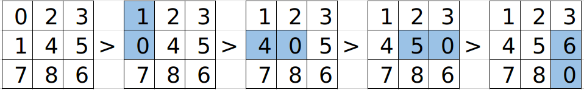
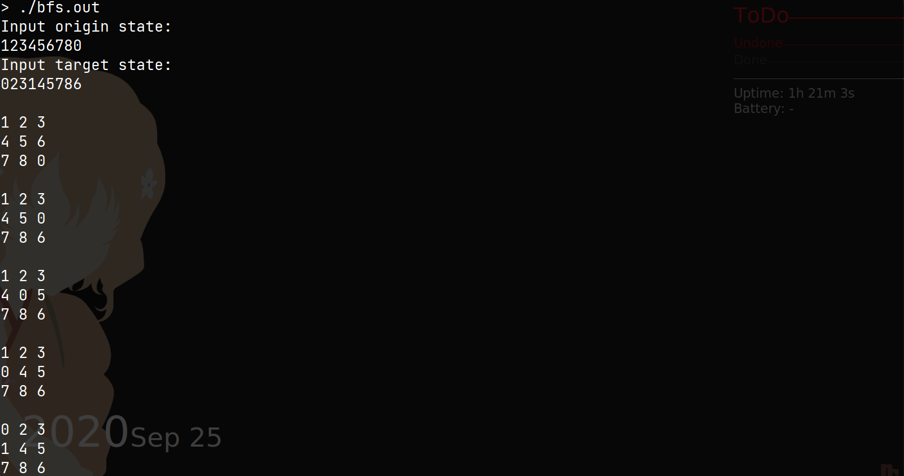
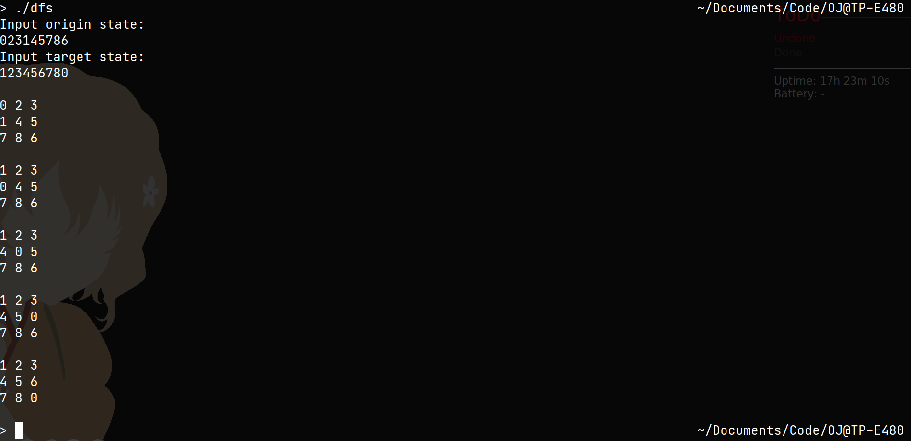
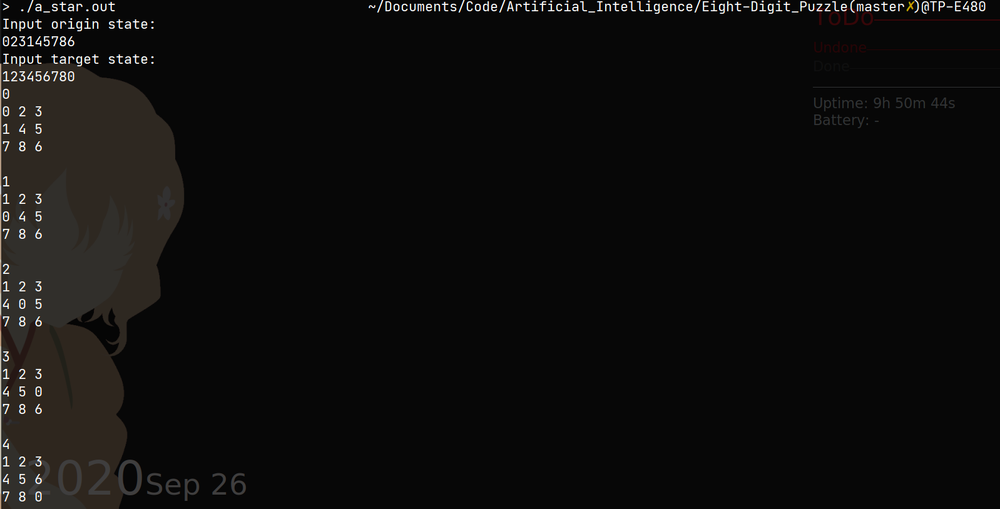

# 八数码问题

## 问题描述

一个内含8个数码以及一个空位的九宫格，其中空位可以与相邻的数码交换位置，给定一个初始状态与一个目标状态，求出要从初始状态变换到目标状态的最短路径。~~用人话说~~其实就是数字版的华容道，可以看做由八个可以平移的板子和一个空位组成的九宫格。

例如，给定初始状态：023145786，目标状态：123456780。则变换过程如下：



## 问题分析

对于九宫格的每一个状态，可以简单的用一个9位的字符串表示，以0表示空位。由于只有与0相邻的板块可以移动，对于每一步变换可以看做0向四个方向中任一方向的移动。如上图中由023145786变换到123045786，可以看做0向下移动。

考虑解空间，每种状态都是九个数字的一种排列，因此**一共存在：9! = 362880种状态**。那么对任意两个状态而言，它们是否可以通过变换互相转化呢？

首先要观察当状态变换时，改变了哪些东西。比如，对于状态123405678而言，一共有四种变换方向，根据0的移动称为上下（左右）变换：

对于左右变换，非0数字的顺序不变：

123405678、123045678、123450678忽略空位0后都是12345678

对于上下变换，相邻非0数字对换2次：

103425678忽略空位0是13425678相当于12345678->1 32 45678->13 42 5678

123475608则相当于12345678->12345 76 8->1234 75 68

跟据线性代数的知识可以知道，上述变换皆不会改变数列中逆序数的奇偶性。因此，**两状态序列（忽略0）的逆序数奇偶性不同时，互相不可达**。

可知对于任一状态，可以通过变换到达的状态只有状态总数的一半，即9! / 2 = 181440种。

*以上都是在编程过程中产生的一些疑问，实际上并没有怎么用到（逃*

## BFS求解

说到最短路径，解空间不算离谱，状态变换方式也有限，第一反应当然是BFS大法！

时间复杂度:O(b^d)

空间复杂度:O(b^d)

### 输入

两行字符串，分别表示初始状态和目标状态。

### 输出

依次输出两状态间的所有状态

### 算法描述

定义函数swap_elem(const string& str, int, int)，返回一个str交换两元素位置后的string，且不改变str，用作生成当前状态作出相应变换后的状态，非法变换返回"error"。

定义队列state_queue用于BFS。

定义map<string, bool> is_arrived保存已经过的状态。

伪码描述：

```
state_queue.push(origin_state)
while(!state_queue.empty())
{
	cur_state = state_queue.pop()
    if(cur_state == target_state)
    {
        output();
        break;
    }
    is_arrived[cur_state] = true
    for(i)
    {
        possible_state = swap_elem(cur_state, zero_pos, zero_pos + phase(i))
        if(possible_state == "error" || is_arrived[possible_state])
        {
        	continue;
        }
        state_queue.push(possible_state)
    }
}
```

### 实际运行结果



## DFS求解

用DFS找最短路径最大的困难是，程序好难调试。。以及无法停机，这里实际用的是DLS，设定了最大搜索深度。

时间复杂度:O(b^m)

空间复杂度:O(bm)

### 输入

两行字符串，分别表示初始状态和目标状态。

### 输出

依次输出两状态间的所有状态

### 算法描述

定义函数swap_elem(const string& str, int, int)，返回一个str交换两元素位置后的string，且不改变str，用作生成当前状态作出相应变换后的状态，非法变换返回"error"。

定义map<string, bool> is_arrived保存已经过的状态。

定义map<string, ing> step_left保存当前状态距目标状态的距离， 维护这个映射一方面方便输出路径，另一方面避免重复计算。

伪码描述：

```
// DFS()
if(depth > max_depth)
{
	return;
}
if(cur_state == target_state)
{
    step_left[cur_state] = 0;
    return;
}
step_left[cur_state] = infinity;
is_arrived[cur_state] = true
for(i)
{
	possible_state = swap_elem(cur_state, zero_pos, zero_pos + phase[i])
	if(possible_state == "error" || is_arrived[possible_state])
	{
		continue;
	}
	
	if(step_left.notfound(possible_state))
	{
		DFS(possible_state)
	}
	
	if(step_left[possible_state] + 1 < step_left[cur_state])
	{
		step_left[cur_state] = step_left[possible_state] + 1
	}
}
is_arrived[cur_state] = false
```

### 实际运行结果



## IDS求解

IDS可以结合DFS在空间上的优点和BFS在时间上的优点，表现非常优秀。

时间复杂度:O(b^d)

空间复杂度:O(bd)

### 输入

两行字符串，分别表示初始状态和目标状态。

### 输出

依次输出两状态间的所有状态

### 算法描述

定义函数swap_elem(const string& str, int, int)，返回一个str交换两元素位置后的string，且不改变str，用作生成当前状态作出相应变换后的状态，非法变换返回"error"。

定义map<string, bool> is_arrived保存已经过的状态。

伪码描述：

```
while(!is_found)
{
	DFS(origin_state)
	++max_depth
}

DFS()
{
	if(cur_state == target_state)
	{
		is_found = true
		print_str(cur_state)
		return
	}
	if(depth > max_depth)
	{
		return
	}
	is_arrived[cur_state] = true
	for(i)
	{
		possible_state = swap_elem(cur_state, zero_pos, zero_pos + phase[i])
		if(possible_state == "error" || is_arrived[possible_state])
		{
			continue;
		}
		if(!is_found)
		{
			DFS(possible_state)
		}
	}
	if(is_found)
	{
		print_str(cur_state)
	}
	is_arrived[cur_state] = false
}
```

### 实际运行结果


## A*求解

我们启发式算法真是，太~棒~了！非启发搜索，不行！启发式搜索，行！！

### 输入

两行字符串，分别表示初始状态和目标状态。

### 输出

依次输出两状态间的所有状态

### 算法描述

定义函数swap_elem(const string& str, int, int)，返回一个str交换两元素位置后的string，且不改变str，用作生成当前状态作出相应变换后的状态，非法变换返回"error"。

定义multiset\<string\> open保存并排序待展开状态。

定义set\<string\> close保存已展开状态

定义map<string, int> depth保存结点深度

伪码描述：

```
while(!open.empty())
{
	cur_state = *open.begin()
	open.erase(cur_state)
	close.insert(cur_state)
	if(cur_state == target_state)
	{
		Output()
		break
	}
	for(i)
	{
		possible_state = swap_elem(cur_state, zero, zero + phase[i])
		if(possible_state == "error" || close.find(possible_state))
		{
			continue
		}
		depth[possible_state] = depth[cur_state] + 1
		open.insert(possible_state)
	}
}
```

### 实际运行结果



