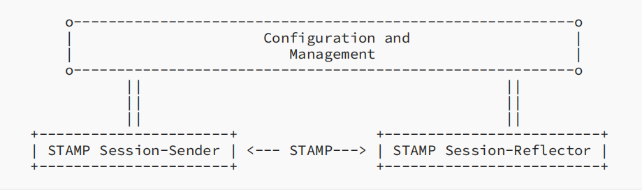
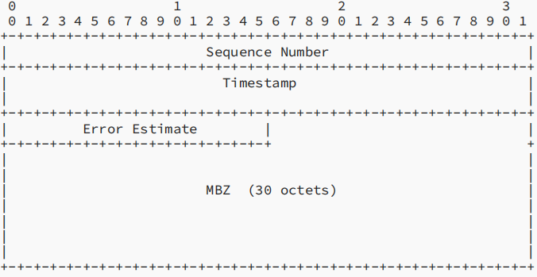
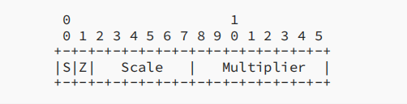
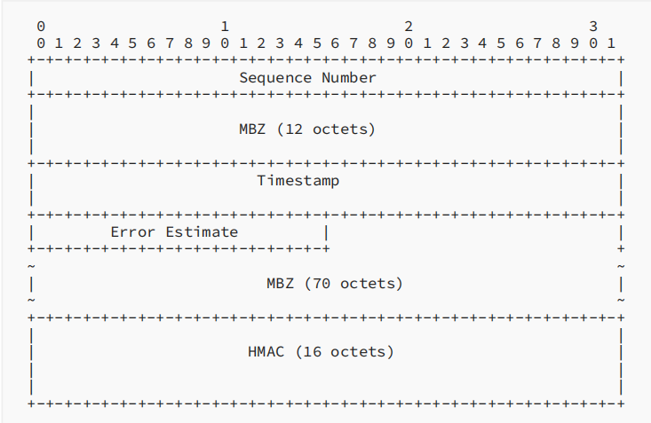
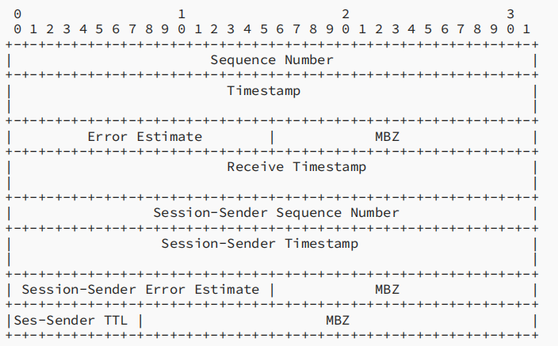
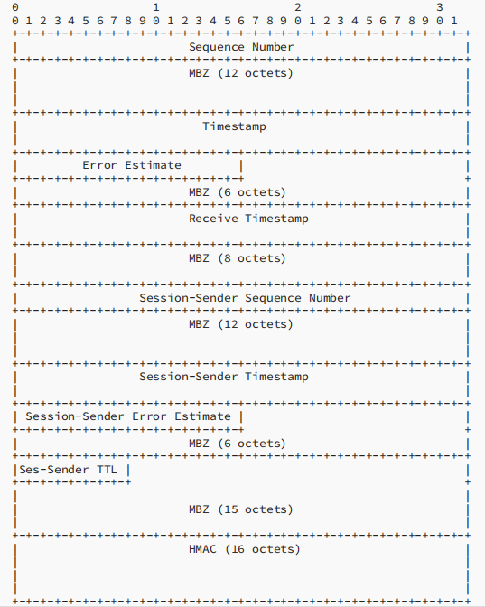

# RFC8762 Simple Tow-Way Active Measurement Protocol 部分译注

### 摘要

这篇文档描述了Simple Two-Way Active Measurement Protocol(STAMP 简单双向连接测度协议)，此协议实现了对单向和往返性能指标——比如延迟，延迟变化和丢包——的测度。

### 1. 导论

*为什么要制作新的协议？因为旧协议已经无法满足需求。*

开发和部署Two-Way Active Measurement Protocol(TWAMP 双向连接测量协议)和它的拓展提供了非常宝贵的经验。很多对TWAMP和TWAMP Light的独立实现已经部署，并且提供了重要的运行性能测度。

与此同时，关于能否使用一个更简单的连接性能监测装置也令人非常感兴趣。这个装置提供特定行为并且内在分离的控制和测试功能。最近Broadband Forum关于"使用TWAMP Light从IP边缘到用户设备的性能测度"的工作示范了在TWAMP Light中实现交互性是非常困难的。因为TWAMP Light的构成和操作并没有明确的规定。根据规定，TWAMP Light包括了一个TWAMP-Test测试功能的子集。因此，为了一个全面的工具去测度丢包和延迟需要其它提供了控制和安全措施的应用提供支持。

这篇文档定义了一个连接性能测度协议——STAMP，它可以测度one-way和round-trip性能指标，比如延迟，延迟变化和丢包。并且支持一些TWAMP的拓展。

### 2. 这篇文档中用到的约定

#### 2.1 术语

STAMP: Simple Two-way Active Measurement protocol 简单双向连接测度协议。

NTP: Network Time Protocol 网络时间协议

PTP: Precision Time Protocol 精确时间协议

HMAC: Hashed Message Authentication Code 哈希信息验证码

OWAMP: One-Way Active Measurement protocol 单向连接测度协议

TWAMP: Two-Way Active Measurement protocol 双向连接测度协议

MBZ: Must be Zero 必须为0

PDU: 协议数据单元

#### 2.2 语言约定

下列关键词：**”必须“,  ”必不“, ”要求“, ”有责任“, ”有责任不“, ”应该“, ”应不“, "建议", "不建议", "可能", "可选"**在全大写时为RFC2119和RFC8174中的含义。

### 3. 基于STAMP的性能测度运作和管理

图1表示了STAMP一个测度session中的Session-Sender和Session-Reflector。在这篇文档中，测度会话（也称为STAMP会话）是一段时间内一个特定的Session-Sender和Session-Reflector间的双向包流。对STAMP Session-Sender，Session-Reflector和sessions的设置和管理不在本文档的讨论范围内，并且可以通过多种方式达成。

*图1 STAMP参考模型*

### 4. 运作理论

STAMP Session-Sender通过UDP传输测试数据包给STAMP Session-Reflector，STAMP Session-Reflector接收到数据包后跟据配置运行。STAMP Session-Reflector有两种运行方式：

* 无状态模式：

  STAMP Session-Reflector不维护测试状态，并且使用接收包的递增字作为返回包的递增字。在无状态模式下，接收包和返回包的递增字相同，并且只能计算往返丢包。

* 有状态模式：

  STAMP Session-Reflector维护测试状态，因此允许Session-Sender通过鉴别递增字直接确定丢包情况。有状态模式下任何丢包都可以计算。这要求STAMP Sessioon-Reflector **必须**维护每个STAMP-Test session的状态，以使每个STAMP-Test包唯一地对应一个STAMP-Test session实例，并且让递增字能够在每个session的基础上独立地递增。

STAMP支持两种验证模式：无验证模式和验证模式。无验证模式的STAMP-Test包，定义于4.2.1和4.3.1小节，确保STAMP和TWAMP Light可以使用4.6小节描述的包结构协同工作。

默认情况下，STAMP使用对称的包，例如，Session-Reflector发送的包和它接收的包大小相等。

#### 4.1 STAMP测试中的UDP端口号

STAMP Session-Sender **必须**使用UDP端口862（TWAMP-Test Receiver 端口）作为默认目标端口。STAMP的实现**必须**可以被当作从User Ports到Dynamic Ports的UDP目标端口。在使用User Port范围内的端口时，**必须**由计划使用STAMP测试的网域中所有用户小心地检测和确认是否可能存在碰撞。

默认情况下，STAMP Session-Reflector **必须**从UDP端口862接收STAMP-Test packets。一个支持此标准的Session-Reflector**必须**可以从User Ports和Dynamic Ports中定义用来接收STAMP-Test packets的端口。STAMP定义了两种不同的测试包格式：一种由STAMP Session-Sender发送，另一种由STAMP Session-Reflector发送。

#### 4.2 Session-Sender运行方式和包格式

STAMP Session-Sender支持对称的测试包大小作为其默认运行方式。一个返回的测试包包括了Session-Reflector的信息，因此，它比较大。为了确保STAMP基础测试包的对称性，STAMP Session-Sender基础包要包含MBZ区域以匹配返回基础测试包的大小。由此，一个STAMP Session-Sender 基础包在无验证模式下至少有44个字节大小，在验证模式下至少有112个字节大小。

##### 4.2.1 无验证模式的Session-Sender包格式

各区域定义如下：

* 顺序字(Sequence Number)区域4字节长。对每个新session，它的值从0开始并且每次传输加1。

* 时间戳(Timestamp)区域8字节长。STAMP结点**必须**支持NTP第4版的64位时间戳格式，**可能**支持IEEE 1588v2的PTP缩短64位时间戳格式。使用某个具体的格式，NTP或PTP，是Session-Sender配置的一部分或者是特定的测试session。

  > NTP: 前32位表示1900/01/01/00:00到现在的秒数。后32位表示秒数的小数部分。
  >
  > PTP：超高精度时间协议，不太了解。

* 校错(ErrorEstimate)区域2字节长，并拥有如下格式：

  

  S，Scale和Multiplier区域和RFC4656第4.1.2节处的定义相同。Z位和RFC8186处的定义相同：

  0: NTP64位时间戳格式

  1: PTPv2 缩短64位时间戳格式

  STAMP默认使用NTP64位时间戳格式（Z的值为0）。使用配置/管理函数的一个操作**可能**将STAMP Session-Sender和Session-Reflector配置为使用PTPv2格式时间戳（Z的值为1）。注意支持这一标准的Session-Sender实现**可能**被配置为使用PTPv2格式时间戳，即便Session-Reflector被配置为使用NTP格式。

  > S位， 当本方使用了用其它源同步UTC的时钟生成时间戳时**应该**设为1，否则设为0。
  >
  > Scale和Multipliter都是无符号的整数，并满足此关系： error estimate
  > is equal to Multiplier*2^(-32)*2^Scale (in seconds)，这两个值应该是每个机器自行设定的，但Multipliter不可设为0。

* MBZ区域10字节长。它在传输时每一位**必须**为0并且在接收时**必须**被忽略。

##### 4.2.2 验证模式下的Session-Sender包格式

各区域的定义与4.2.1小节相同，注意MBZ区域在计算hash值时不可忽略。该模式下主要是增加了一个HMAC hash值在PDU的末尾。关于HMAC的使用将在4.4小节进行描述。

#### 4.3 Session-Reflector运行方式和包格式

Session-Reflector接收并验证测试包。如果测试包通过了验证，符合本标准的Session-Reflector会准备并传输一个与接收到的测试包对称的返回测试包，并包含接收到的测试包信息以及一些附加信息。

##### 4.3.1 无验证模式下的Session-Reflector包格式

各区域定义如下：

* 顺序字区域4字节长。其值取决于Session-Reflector的模式：
  * 在无状态模式下，顺序字的值是收到的测试包顺序字的拷贝。
  * 在有状态模式下，Session-Reflector对接收到的测试包计数。对每个测试session，这个数从0开始，并且每接收到一个包就加1。Session-Reflector使用这些计数对顺序字区域设置值。
* 时间戳和接收时间戳（Receive Timestamp）区域都是8字节长。格式可以为NTP格式或PTPv2格式，通过误差估计区域的Z值进行确定。接收时间戳是接收到包的时间，时间戳是开始发送包的时间。
* 误差估计区域的定义和4.2.1节相同。
* Session-Sender相关区域由接收到的包复制而来。
* Session-Sender TTL区域1字节长，由IPv4包的TTL区域复制而来。
* MBZ区域保证包大小是4字节的倍数。

##### 4.3.2 验证模式下的Session-Reflector包格式

各区域定义与4.3.1小节相同，MBZ参与hash值计算，HMAC在4.4节说明。

#### 4.4 STAMP中的完整性保护

验证模式通过添加哈希化消息验证码（HMAC）为每个STAMP消息提供完整性保护。STAMP使用HMAC-SHA-256缩减到128bits；因而，HMAC区域的大小是16字节。在验证模式下，HMAC覆盖开始的6个区块（96字节）。HMAC使用自己的密钥，每个STAMP-Test Session的密钥各不相同；密钥管理和对HMAC密钥的生成机制超出了本文档的讨论范围。HMAC**必须**尽可能早地验证，以避免使用错误的数据。

未来的标准可能会定义更高级的算法。

#### 4.5 STAMP中的信息保护

如果STAMP需要对信息进行保护，STAMP-Test Session**必须**使用安全的传输。

#### 4.6 与TWAMP Light的协同工作

因为STAMP和TWAMP Light使用了不同的验证算法（HMAC-SHA-256和HMAC-SHA-1），协同工作只能在无验证模式下进行。以下组合是可能的：

* STAMP Session-Sender 和 TWAMP Light Session-Reflector
* TWAMP Light Session-Sender和STAMP Session-Reflector

