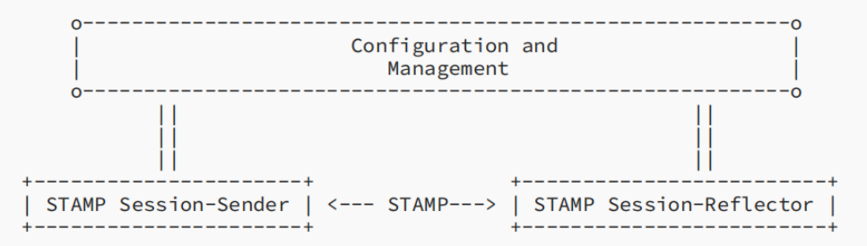
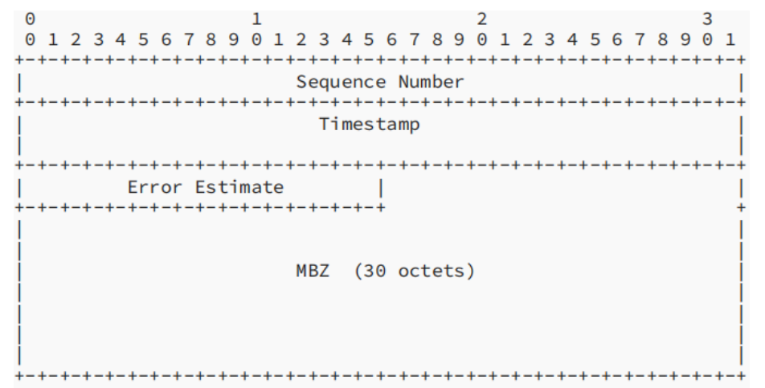
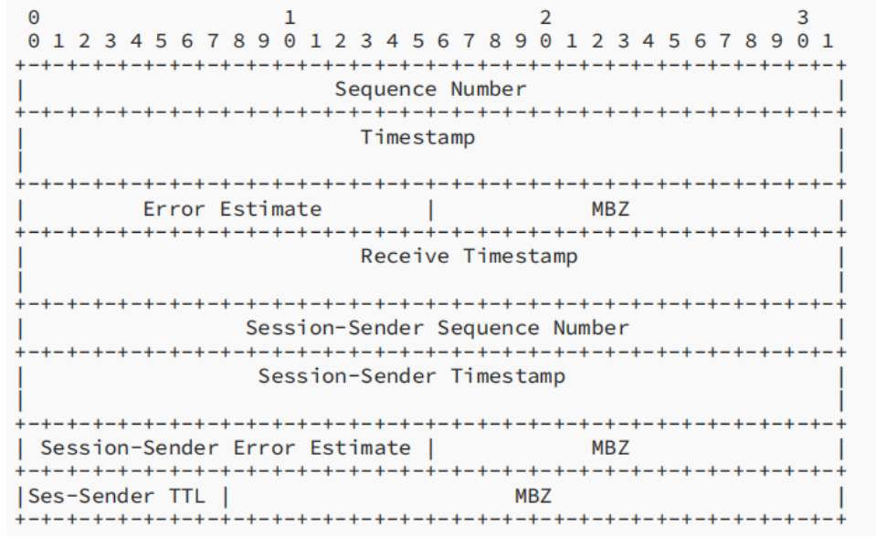

# 计算机网络作业——STAMP测试协议的介绍

## 背景简介

STAMP是Simple Two-Way Active Measurement Protocol的简写，此协议实现了对单向和往返性能指标——比如延迟，延迟变化和丢包——的测试。

目前已存在的测试协议在OWAMP(One-Way Active Measurement Protocol)和在其基础上发展而来的TWAMP(Two-Way Active Measurement Protocol)。很多情况下，人们觉得实现一个TWAMP太过复杂，因而一个更轻量级的协议——TWAMP Light应运而生。

但很多实际应用显示，在TWAMP Light中实现交互是很困难的。因为TWAMP Light的构成和行为并没有明确的规定，根据规定，TWAMP Light包括了一个TWAMP-Test测试功能的子集。因此要想实现一个全面的测试还需要其它提供了控制和安全措施的应用提供支持。

基于这种背景，STAMP诞生了。

## STAMP的工作原理

### 基本原理

下图表示了STAMP一个测试会话中的发送者(Session-Sender)和接收者(Session-Reflector)。在这里，测试会话（也称为STAMP会话）是一段时间内一个特定的发送者和接收者间的双向包流。

发送者通过UDP传输测试数据包给接收者，接收者收到数据包后进行处理。接收者有两种运行方式：

* 无状态模式：

  接收者不维护测试状态，并且使用接收包的顺序字作为返回包的顺序字。在无状态模式下，接收包和返回包的顺序字相同，并且只能计算往返丢包。

* 有状态模式：

  接收者维护测试状态，因此允许发送者通过鉴别递增字直接确定丢包情况。有状态模式下任何丢包都可以计算。这要求接收者必须维护每个测试会话的状态，以使每个测试数据包唯一地对应一个测试会话实例，并且让递增字能够在每个会话的基础上独立地递增。

STAMP支持两种验证模式：无验证模式和验证模式。

STAMP使用UDP协议862端口（TWAMP-Test Receiver 端口）作为默认端口。STAMP的实现支持在User Ports和Dynamic Ports中定义使用的端口。

### 包格式

STAMP定义了两种不同的测试包格式：一种由发送者发送，另一种由接收者发送。STAMP使用对称的包，但一个由接收者返回的包要附带相关信息，因此比较大。为了确保包的对称性，发送者发出的包要包含MBZ(Must Be Zero)区域以匹配返回包的大小。

#### 无验证模式的发送包

各区域定义如下：

* 顺序字(Sequence Number)区域4字节长。对每个新会话，它的值从0开始并且每次传输加1。

* 时间戳(Timestamp)区域8字节长。STAMP必须支持NTPv4格式，可能支持PTPv2格式。

* 误差估计(Error Estimate)区域2字节长，并拥有如下格式：

  

  S，Scale和Multiplier区域：

  S位， 当本方使用了用其它源同步UTC的时钟生成时间戳时**应该**设为1，否则设为0。

  Scale和Multipliter都是无符号的整数，并满足此关系： error estimate
  is equal to Multiplier*2^(-32)*2^Scale (in seconds)，这两个值应该是每个机器自行设定的，但Multipliter不可设为0。

  Z区域：

  0: NTP64位时间戳格式

  1: PTPv2 缩短64位时间戳格式

  STAMP默认使用NTP64位时间戳格式（Z的值为0）。

* MBZ区域。它在传输时每一位必须为0并且在接收时必须被忽略。

#### 无验证模式的返回包

各区域定义如下：

* 顺序字区域4字节长。其值取决于接收者的模式：
  * 在无状态模式下，顺序字的值是收到的测试包顺序字的拷贝。
  * 在有状态模式下，接收者对接收到的测试包计数。对每个测试会话，这个数从0开始，并且每接收到一个包就加1。
* 时间戳和接收时间戳（Receive Timestamp）区域都是8字节长。格式可以为NTP格式或PTPv2格式，通过误差估计区域的Z值进行确定。接收时间戳是接收到包的时间，时间戳是开始发送包的时间。
* 误差估计区域的定义和发送包相同。
* 发送者相关区域由接收到的包复制而来。
* TTL区域1字节长，由IPv4包的TTL区域复制而来。
* MBZ区域保证了包大小是4字节的倍数。

#### 验证模式下的包

* 发送包

* 返回包

验证模式通过添加哈希化消息验证码（HMAC）为每个STAMP消息提供保护。STAMP使用HMAC-SHA-256缩减128字节算法；因而，HMAC区域的大小是16字节。HMAC覆盖开始的6个区块（96字节）。HMAC使用自己的密钥，每个STAMP-Test Session的密钥各不相同。未来的标准可能会定义更高级的算法。

## 参考文献

RFC8762: G. Mirsky , G. Jun, H. Nydell, R. Foote - "Simple Two-Way Active Measurement Protocol"

RFC6038: A. Morton and L. Ciavattone - "Two-Way Active Measurement Protocol (TWAMP) Reflect Octets and Symmetrical Size Features"

RFC5357: K. Hedayat, R. Krzanowski, A. Morton, K. Yum, J. Babiarz - "A Two-Way Active Measurement Protocol (TWAMP)"

RFC4656: S. Shalunov, B. Teitelbaum, A. Karp, J. Boote, M. Zekauskas - "A One-way Active Measurement Protocol (OWAMP)"

